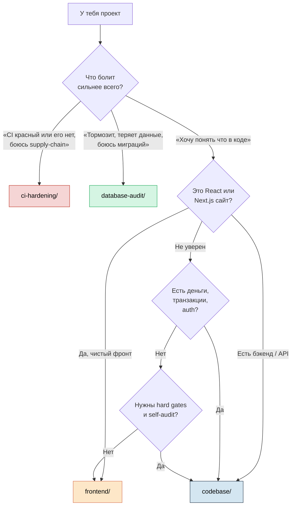

<div align="center">
  

  <h1>Audit Pipelines</h1>

  <p>
    <b>Глубокий аудит кода за один прогон Claude Code.</b><br/>
    На выходе — приоритизированный roadmap улучшений с пруфами из кода.
  </p>

  <p>
    <a href="https://t.me/pomogay_marketing">
      
    </a>
    <a href="https://vechkasov.pro">
      
    </a>
    <a href="LICENSE">
      
    </a>
  </p>

  <p>
    
    
    
    
    
  </p>
</div>

<br/>

> Если ты владелец продукта, тимлид, инвестор или просто человек, у которого есть кодовая база и нет ответа на вопрос «а что там вообще происходит и куда это всё катится» — это для тебя.

---

## Зачем это нужно

У любого живого проекта со временем накапливается **технический долг**. Это как захламлённая квартира: вроде жить можно, но новый шкаф уже не воткнуть, а лампочку поменять — это целое приключение, потому что выключатель завязан на стиральную машину через десять проводов.

В коде то же самое. Симптомы знакомые:

| Симптом | Что это значит на самом деле |
|---|---|
| «Здесь страшно трогать» | Нет тестов, изменения каскадируют непредсказуемо |
| Простая фича делается две недели вместо двух дней | Архитектурный долг съел скорость команды |
| Сайт тормозит, никто не знает почему | Нет мониторинга и замеров производительности |
| Зависимости не обновлялись с динозавров | Известные дыры в безопасности; supply chain-риск |
| «Тесты есть, но мы не уверены что они работают» | Test smells, низкое покрытие критичных путей |

Чтобы починить — сначала нужно увидеть. Этим и занимается аудит.

> **Раньше** для этого нанимали консультанта на $200/час, который три недели ходил по коду и в конце выдавал PDF на 80 страниц.
> **Сейчас** — это делает Claude Code за пару часов и стоит как обед в кафе.

Эти пайплайны — готовый набор инструкций, который превращает Claude из «умного чатбота» в систематичного аудитора. Он не пропускает фазы, не придумывает находки из воздуха, и в конце выдаёт **roadmap с приоритетами** — что чинить сейчас, что через месяц, а что вообще не трогать.

---

## Четыре пайплайна — выбери свой

<table>
<tr>
<td width="50%" valign="top">

### 🎨 [`frontend/`](./frontend)

**React / Next.js сайты**

7 фаз: архитектура → roadmap.

- Архитектура и тех.долг
- Performance + Core Web Vitals
- Accessibility (WCAG 2.2) и SEO
- Security: CVE, секреты, XSS
- DX, тулинг, CI/CD
- Roadmap Now / Next / Later

**Для:** маркетинговых сайтов, e-commerce, SPA, лендингов на Next.js.

[Запустить →](./frontend)

</td>
<td width="50%" valign="top">

### 🛡️ [`codebase/`](./codebase)

**Универсальный аудит — любой стек**

13+ фаз с hard exit gates.

- Trust Map (потоки данных)
- Money & State Invariants
- Self-audit + adversary review
- Hard exit gates через скрипты
- Машинная сводка `_meta.json` для CI
- Phase 11 deep-dive при critical

**Для:** бэкенда, API, ботов, монорепо. Python, Go, TypeScript, Java, Rust.

[Запустить →](./codebase)

</td>
</tr>
<tr>
<td width="50%" valign="top">

### 🔒 [`ci-hardening/`](./ci-hardening)

**Безопасный CI/CD на GitHub**

6 этапов аудита + 4 фазы внедрения.

- Supply-chain hardening (SHA-пины, cooldown)
- Least-privilege permissions
- Harden-Runner + zizmor
- OIDC вместо long-lived secrets
- Готовый `ci.yml` под автодетект стека
- Roadmap Phase 0 → 3

**Для:** любого GitHub-репо с CI или без. Учтены инциденты tj-actions, trivy-action, axios.

[Запустить →](./ci-hardening)

</td>
<td width="50%" valign="top">

### 🗄️ [`database-audit/`](./database-audit)

**Глубокий аудит БД с автономным мастер-промтом**

14 фаз · 30 детекторов · 11 ORM · Serena+GitNexus · v5.1

- **Master prompt** — один промт, путь к проекту, всё автономно
- **Live drift verification** — invariant queries в проде
- **SQLi detection** через `$queryRawUnsafe` + ORM wrappers
- **Race conditions** + Float-money + idempotency
- **FK priority by table size** (live evidence cross-ref)
- **PII** + endpoint-aware exposure (GitNexus route_map)
- **Auth bypass** + cross-tenant leak (cypher queries)
- **Auto-fill** phase 11 (trace + blast radius через `gitnexus impact`)
- **ROADMAP time-budget** — Quick wins / Sprint plan / Quarter goals
- **Verify-fix** prompt — re-check applied fixes
- **Multi-project compare** — severity matrix между проектами

**Для:** проектов с БД (Postgres, MySQL, Mongo, ...). 11 ORM: Prisma, Drizzle, TypeORM, Sequelize, Mongoose, SQLAlchemy, Django, GORM, ActiveRecord, Hibernate, raw SQL. Static + опц. live mode с `DATABASE_URL`.

[Запустить →](./database-audit)

</td>
</tr>
</table>

### Какой пайплайн выбрать?



> Пайплайны не взаимоисключают друг друга. Хорошая последовательность: `codebase` или `frontend` → правки по roadmap → `database-audit` если есть БД → `ci-hardening` чтобы зашить найденное в CI.

---

## Что получишь на выходе

Главный артефакт всех четырёх пайплайнов — **ROADMAP**. У `ci-hardening` дополнительно — готовый `ci.yml`. У `database-audit` — машинная сводка `_meta.json` и `_known_unknowns.md` (что осталось проверить). Это не «80 страниц красивых слов», а конкретный список:

```
🔴 Сейчас (Now):
  └─ [critical] SQL-инъекция в /api/search — api/search.ts:42
     → как чинить, сколько займёт, что сломается если не починить

🟡 Дальше (Next):
  └─ [high] N+1 запрос в загрузке профиля — lib/user.ts:118
     → меняет ответ с 4 секунд на 200 мс

🟢 Потом (Later):
  └─ [medium] Дублирование логики валидации — 6 мест
     → не критично, но затрудняет добавление новых полей
```

<details>
<summary><b>Что есть у каждой находки</b></summary>

| Поле | Что это |
|---|---|
| `severity` | Насколько критично: `critical` / `high` / `medium` / `low` |
| `evidence` | Точное место в коде (файл:строка) с цитатой |
| `impact` | Что это значит для бизнеса |
| `fix` | Как чинить — конкретные шаги, не «улучшить X» |
| `effort` | Сколько времени займёт (S/M/L) |
| `confidence` | Насколько аудитор уверен в находке (`high`/`medium`/`low`) |
| `references` | Ссылки на документацию / OWASP / книги |

Никаких «возможно», «вероятно», «было бы неплохо». Только факты с пруфами.

</details>

---

## Как этим пользоваться (для не-программистов)

<table>
<tr>
<td width="60px" align="center"><b>1️⃣</b></td>
<td><b>Дай ссылку на этот репозиторий своему разработчику</b> (или нанятому подрядчику) и попроси прогнать аудит. Это ~2-3 часа его времени.</td>
</tr>
<tr>
<td align="center"><b>2️⃣</b></td>
<td><b>Получи <code>ROADMAP.md</code></b> — читать его можно прямо в GitHub или в любом текстовом редакторе. На русском, человекочитаемый.</td>
</tr>
<tr>
<td align="center"><b>3️⃣</b></td>
<td><b>Обсуди приоритеты с командой.</b> Roadmap уже отсортирован по формуле <code>(impact × confidence) / effort</code>, но решение что брать в работу — за тобой.</td>
</tr>
<tr>
<td align="center"><b>4️⃣</b></td>
<td><b>Раз в квартал — повтори.</b> Сравнишь динамику: что починили, что новое появилось, движется ли проект в правильном направлении.</td>
</tr>
</table>

Если разработчика нет — можно прогнать самостоятельно. Нужен только установленный [Claude Code](https://claude.com/claude-code) и ~30 минут на установку зависимостей. Дальше — копипаст команды в чат.

---

## Что нужно установить (один раз)

<table>
<tr>
<td width="33%" valign="top" align="center">
<h3>Claude Code</h3>
<a href="https://claude.com/claude-code">claude.com/claude-code</a><br/>
<i>основной оркестратор</i>
</td>
<td width="33%" valign="top" align="center">
<h3>Serena</h3>
<a href="https://github.com/oraios/serena">oraios/serena</a><br/>
<i>семантика кода (LSP)</i>
</td>
<td width="33%" valign="top" align="center">
<h3>GitNexus</h3>
<a href="https://www.npmjs.com/package/gitnexus">npmjs.com/gitnexus</a><br/>
<i>граф кода + история</i>
</td>
</tr>
</table>

Команды установки — в README конкретного пайплайна. **Для `ci-hardening`** хватает только Claude Code. Для `database-audit` опционально — `psql`/`mysql`/`mongosh` для live-mode.

---

## Принципы, которые зашиты во все четыре пайплайна

<table>
<tr><td><b>📂 Read-only</b></td><td>Пайплайн ничего не меняет в коде. Только смотрит и пишет отчёт.</td></tr>
<tr><td><b>🔬 Факты, не мнения</b></td><td>Каждая находка с измерением или цитатой. Никаких «мне кажется».</td></tr>
<tr><td><b>🔥 Hot spots first</b></td><td>Чиним там, где часто ломается (методология Adam Tornhill).</td></tr>
<tr><td><b>🧪 Тесты до рефакторинга</b></td><td>Сначала характеризационные тесты, потом изменения (Michael Feathers).</td></tr>
<tr><td><b>🎯 Точечные fix'ы</b></td><td>Никаких переписываний с нуля.</td></tr>
<tr><td><b>⚖️ Severity по импакту</b></td><td>Никто не получает critical за «непривычное именование».</td></tr>
</table>

---

## На какой методике это построено

Не «придумано в гараже». В основе — классика индустрии:

<table>
<tr>
<td valign="top" width="50%">

**Архитектура и тех.долг**
- Robert C. Martin — *Clean Architecture*
- Martin Fowler — *Refactoring*
- Michael Feathers — *Working Effectively with Legacy Code*
- John Ousterhout — *A Philosophy of Software Design*
- Adam Tornhill — *Your Code as a Crime Scene*

**Resilience и распределённые системы**
- Michael Nygard — *Release It!*
- Martin Kleppmann — *Designing Data-Intensive Applications*
- Pat Helland — *Life Beyond Distributed Transactions*
- Google — *SRE Book*

**Базы данных и схемы**
- C.J. Date — *Database Design and Relational Theory*
- Bill Karwin — *SQL Antipatterns*
- Markus Winand — *Use the Index, Luke* / *SQL Performance Explained*
- Joe Celko — *SQL for Smarties* / *SQL Programming Style*
- Schwartz et al. — *High Performance MySQL*; Greg Smith — *PostgreSQL High Performance*
- Sadalage & Ambler — *Refactoring Databases*
- Vlad Mihalcea — *High Performance Java Persistence*
- Bernstein & Newcomer — *Principles of Transaction Processing*

</td>
<td valign="top" width="50%">

**Performance, A11y, SEO**
- Ilya Grigorik — *High Performance Browser Networking*
- Jeremy Wagner — *Web Performance in Action*
- Heydon Pickering — *Inclusive Components*
- W3C WCAG 2.2 · WAI-ARIA APG
- Web.dev (Core Web Vitals)

**Security и supply-chain**
- OWASP Top 10 + Cheat Sheets
- Saltzer & Schroeder — *Protection of Information*
- GitHub Docs — *Security hardening for Actions*
- GitHub Actions 2026 Security Roadmap
- StepSecurity Harden-Runner · zizmor · OpenSSF Scorecard
- Incident reports: tj-actions, trivy-action, axios, bitwarden/cli

**Когнитивные ошибки в анализе**
- Daniel Kahneman — *Thinking, Fast and Slow*
- Forsgren / Humble / Kim — *Accelerate*

</td>
</tr>
</table>

---

## Лицензия

[MIT](LICENSE). Бери, форкай, адаптируй под себя — добавляй фазы, меняй пороги, расширяй чек-листы. Это набор markdown-инструкций + bash/python скриптов, не закрытый продукт.

---

<div align="center">

### Автор


**Кирилл Вечкасов**
AI Development Agency

<a href="https://t.me/pomogay_marketing">
  
</a>
<a href="https://vechkasov.pro">
  
</a>

<br/>

<i>Если нужна помощь с прогоном аудита на твоём проекте<br/>или хочешь адаптировать пайплайн под специфические требования — пиши, обсудим.</i>

</div>
