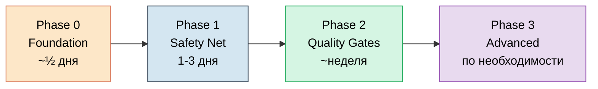

<div align="center">

  <h1>🔒 CI Hardening Kit</h1>

  <p>
    <b>Аудит и постановка безопасного CI/CD на любой GitHub-проект — за один прогон Claude Code.</b><br/>
    Master-промт + готовые workflow-шаблоны + 4-фазный roadmap внедрения.
  </p>

  <p>
    
    
    
    
    
  </p>

  <p>
    <a href="../README.md">← Назад к Audit Pipelines</a> ·
    <a href="../frontend">Фронтенд-пайплайн</a> ·
    <a href="../codebase">Универсальный пайплайн</a>
  </p>
</div>

<br/>

> Если у тебя есть проект на GitHub и нет внятного CI — или CI был написан год назад и с тех пор атакующие научились перезаписывать теги third-party actions — этот кит для тебя.

---

## Зачем это нужно

CI — это не «зелёные галочки на PR». Это **поверхность атаки**: каждый сторонний `action`, каждый секрет в `${{ secrets.* }}`, каждое `pull_request_target` — потенциальный канал утечки. И в 2024–2026 этот канал начали активно использовать.

| Инцидент | Что случилось | Чему учит |
|---|---|---|
| **tj-actions/changed-files** (март 2025) | Перезаписали теги популярного action — утекли секреты у ~23 000 репо через workflow-логи | Mutable refs (`@v4`, `@main`) — главный supply-chain вектор |
| **trivy-action** (март 2026) | 75 из 76 тегов force-pushed, secrets exfiltrated из всех пайплайнов с Trivy | Даже «security-tool» сам может стать атакой |
| **axios 1.14.1 / 0.30.4** (март 2026) | Малварь в `plain-crypto-js` жила ~3 часа — успела попасть в пайплайны с runtime resolve | Lock-файл и cooldown — обязательны |
| **@bitwarden/cli@2026.4.0** | preinstall-hook с credential stealer, цель — `~/.claude.json` и MCP-конфиги | Postinstall/preinstall — тихий вектор |

Этот кит зашивает уроки этих инцидентов в готовый шаблон: SHA-пины, минимальные permissions, harden-runner, cooldown 7 дней, Trivy CLI вместо action. Не «чтобы было», а потому что без этого реально воруют.

---

## Что внутри

```
ci-hardening/
├── AUDIT_PROMPT.md              ← Master-промт для AI-аудита (6 этапов)
├── ROADMAP_TEMPLATE.md          ← Шаблон 4-фазного плана внедрения
├── SECURITY.md                  ← Шаблон security policy для репо
├── .github/
│   ├── workflows/
│   │   ├── ci.yml               ← Универсальный CI с автодетектом стека (Phase 0)
│   │   ├── codeql.yml           ← SAST через CodeQL (Phase 2)
│   │   ├── pinact.yml           ← Проверка SHA-пинов на PR (Phase 2)
│   │   └── scorecard.yml        ← OpenSSF Scorecard (Phase 3, для open source)
│   ├── dependabot.yml           ← С группированием PR по типу
│   ├── pull_request_template.md
│   └── ISSUE_TEMPLATE/
│       ├── bug_report.yml
│       └── feature_request.yml
└── templates/
    └── renovate.json            ← Renovate с cooldown 7 дней
```

---

## Ключевые принципы (что отличает от общих гайдов)

<table>
<tr><td><b>1. SHA-пины везде</b></td><td>Все third-party actions запиннены к full-length commit SHA. Главная защита от tj-actions/trivy-action атак.</td></tr>
<tr><td><b>2. Least privilege</b></td><td><code>permissions: contents: read</code> на уровне workflow. Per-job override только там, где реально нужно больше.</td></tr>
<tr><td><b>3. <code>persist-credentials: false</code></b></td><td>На каждом <code>actions/checkout</code> — токен не остаётся в <code>.git/config</code>.</td></tr>
<tr><td><b>4. Harden-Runner audit</b></td><td>Runtime egress-видимость на каждом job. Так в марте 2026 поймали trivy-action.</td></tr>
<tr><td><b>5. Concurrency + timeouts</b></td><td>Защита от hanging билдов и пустого слива минут на устаревших PR.</td></tr>
<tr><td><b>6. Trivy CLI, не action</b></td><td>trivy-action был скомпрометирован — ставим бинарь напрямую с пином версии.</td></tr>
<tr><td><b>7. zizmor lint</b></td><td>Ловит script injection через <code>${{ }}</code> в <code>run:</code>, dangerous triggers, unpinned actions — до мёржа.</td></tr>
<tr><td><b>8. Cooldown 7 дней</b></td><td>Renovate <code>minimumReleaseAge</code>. Compromised release обычно живёт меньше недели до detection.</td></tr>
<tr><td><b>9. OIDC, не long-lived secrets</b></td><td>Нет того, что можно украсть. AWS/GCP/Azure/npm publish — всё через OIDC.</td></tr>
<tr><td><b>10. Roadmap по фазам</b></td><td>Нельзя «случайно» внедрить всё разом. Каждая фаза = отдельный PR с явным scope-out.</td></tr>
</table>

---

## Как этим пользоваться

### Шаг 1 — Аудит существующего проекта

1. Открой целевой репозиторий в Claude Code (или Cursor / Copilot Workspace) — где есть доступ к файлам.
2. Скопируй содержимое [`AUDIT_PROMPT.md`](./AUDIT_PROMPT.md) и отправь как первое сообщение.
3. AI пройдёт по 6 этапам:
   - **Этап 1** — инвентаризация стека и существующей CI-инфраструктуры
   - **Этап 2** — карта рисков с привязкой к коду
   - **Этап 3** — каталог рекомендованных проверок
   - **Этап 4** — roadmap по 4 фазам
   - **Этап 5** — генерация `AUDIT.md`, `ROADMAP.md`, `ci.yml` под конкретный проект
   - **Этап 6** — самопроверка по чек-листу

### Шаг 2 — Внедрение, по одному PR на фазу

```bash
# Phase 0 — базовый CI
git checkout -b ci/phase-0-foundation
mkdir -p .github/workflows
cp ../ci-hardening/.github/workflows/ci.yml .github/workflows/

# Обнови SHA до актуальных
go install github.com/suzuki-shunsuke/pinact/v3/cmd/pinact@latest
pinact run

git add .github/workflows/ci.yml
git commit -m "ci: add baseline CI with security hardening"
git push -u origin ci/phase-0-foundation
# → открой PR, дождись зелёного билда, мёржни
```

Дальше — Phase 1 (safety net), Phase 2 (quality gates), Phase 3 (advanced) — каждая отдельным PR.

### Шаг 3 — Поддержка

- Раз в 1–2 месяца снова прогоняй `AUDIT_PROMPT.md` — посмотришь что устарело
- Renovate / Dependabot будут автоматически обновлять SHA-пины
- Когда что-то из Phase 3 начнёт реально болеть — внедряй

---

## Roadmap по фазам



| Фаза | Что входит | Acceptance |
|---|---|---|
| **0. Foundation** | Один `ci.yml` с автодетектом стека · typecheck/lint/build (warn-only) · `permissions: contents: read` · concurrency · timeouts · SHA-пины | Зелёный билд на main и PR, < 5 мин на типичный PR, никаких новых требований к разработчикам |
| **1. Safety Net** | Тесты в CI · Dependabot/Renovate · gitleaks · Harden-Runner audit · zizmor lint · branch protection | Упавший CI блокирует мёрж, новые версии приходят PR-ами, видны egress-логи |
| **2. Quality Gates** | CodeQL/Semgrep · coverage ratchet · conventional commits enforced · pinact blocking · OIDC миграция · CODEOWNERS | Coverage не падает, все third-party actions на SHA, long-lived secrets удалены |
| **3. Advanced** | Preview-окружения · bundle/Lighthouse budgets · cosign + SBOM · Harden-Runner block mode · mutation testing · workflow telemetry | Каждый пункт — отдельный PR с документированным кейсом |

Полный план с чек-листами и командами — в [`ROADMAP_TEMPLATE.md`](./ROADMAP_TEMPLATE.md).

---

## Почему именно эти проверки

| Проверка | Что предотвращает | Источник |
|---|---|---|
| SHA-пиннинг actions | Compromise через retargeted git tags (tj-actions март 2025) | [GitHub Docs · Security hardening](https://docs.github.com/en/actions/security-for-github-actions/security-guides/security-hardening-for-github-actions#using-third-party-actions) |
| `permissions: contents: read` дефолт | Privilege escalation если action скомпрометирован | [Secure use reference](https://docs.github.com/en/actions/reference/security/secure-use) |
| `persist-credentials: false` | Утечка `GITHUB_TOKEN` через `.git/config` | actions/checkout README |
| Harden-Runner audit | Runtime detection of exfiltration (как поймали trivy-action) | [StepSecurity docs](https://docs.stepsecurity.io/harden-runner) |
| zizmor lint | Script injection через `${{ }}` в `run:`, dangerous triggers | [zizmor docs](https://woodruffw.github.io/zizmor/) |
| Renovate cooldown 7 дней | Compromised releases обычно живут < 1 недели до detection | Wiz Security Guide |
| Trivy CLI вместо action | Сам trivy-action был скомпрометирован март 2026 | StepSecurity case study |
| OIDC | Нет long-lived secrets для кражи | [GitHub OIDC docs](https://docs.github.com/en/actions/deployment/security-hardening-your-deployments/about-security-hardening-with-openid-connect) |

---

## Когда это НЕ нужно

- **Скрипт на вечер** — не трать время.
- **Прототип, который умрёт через неделю** — Phase 0 максимум.
- **Public repo с одним мейнтейнером без секретов** — достаточно Phase 0 + Phase 1 без OIDC.

## Что это НЕ покрывает

- **Деплой** — слишком зависит от инфраструктуры. См. Phase 3 за общими паттернами.
- **Релизные политики** — semver vs calver, monorepo vs polyrepo, всё индивидуально.
- **Отдельные тулы под язык** (специфика Java/Maven, .NET и т.п.) — только базовый skeleton, дальше дописывай по аналогии.

## Известные ограничения

- **SHA в файлах могут устареть.** Перед использованием прогони `pinact run` — обновит до актуальных.
- **Не все языки покрыты в `ci.yml`.** Есть Node, Python, Go, Rust, PHP. Ruby/Elixir/Java/.NET — дописывай job по аналогии.
- **OIDC и preview-окружения зависят от инфраструктуры.** Phase 2–3 даёт направление, но детали под конкретный cloud — индивидуально.
- **Кит не заменяет Security Settings репо.** Secret scanning, Dependabot alerts, Code scanning default setup включают через GitHub UI.

---

## Источники

- [GitHub Docs · Security hardening for GitHub Actions](https://docs.github.com/en/actions/security-for-github-actions/security-guides/security-hardening-for-github-actions)
- [GitHub Blog · Actions 2026 Security Roadmap](https://github.blog/news-insights/product-news/whats-coming-to-our-github-actions-2026-security-roadmap/)
- [OpenSSF Scorecard](https://github.com/ossf/scorecard)
- [StepSecurity · Harden-Runner](https://docs.stepsecurity.io/harden-runner)
- [Wiz · Hardening GitHub Actions guide](https://www.wiz.io/blog/github-actions-security-guide)
- [zizmor · workflow audits](https://woodruffw.github.io/zizmor/)
- [pinact · pin actions to SHA](https://github.com/suzuki-shunsuke/pinact)

---

<div align="center">

<i>Кит не священен — адаптируй под свой проект. Если что-то непонятно или сломалось — открывай issue с reproduction.</i>

<br/><br/>

<a href="../README.md">← Назад к Audit Pipelines</a>

</div>
