<div align="center">

  <h1>🛡️ Codebase Audit Pipeline <code>v3</code></h1>

  <p>
    <b>Универсальный аудит любой кодовой базы — Python, Go, TypeScript, Java, Rust.</b><br/>
    13+ фаз · встроенные «детекторы вранья» · машинная сводка для CI.
  </p>

  <p>
    
    
    
    
    
  </p>

  <p>
    <a href="../README.md">← Назад к Audit Pipelines</a> ·
    <a href="../frontend">Фронтенд-пайплайн →</a>
  </p>

</div>

---

## Для кого это

> - У тебя **бэкенд, API, бот, монорепо или что-то нестандартное** — не классический фронт-сайт
> - Нужен **глубокий аудит** с пруфами, а не «общие наблюдения»
> - Проект работает с **деньгами / транзакциями / критичными данными** — нужны отдельные проверки на инварианты
> - Хочешь интегрировать аудит в CI и видеть pass/fail по объективным метрикам
> - Уже делал классический аудит, но хочется проверить «а нет ли overconfidence в том отчёте» (v3 проверяет себя сам)

Если у тебя **React/Next.js сайт** — возможно, тебе подойдёт более лёгкий [frontend-пайплайн](../frontend).

---

## Чем v3 отличается от обычного LLM-аудита

> **Обычная проблема LLM-аудита:** агент пишет красиво, но половина находок — выдуманы. Цитата из кода может не существовать. «Confidence: high» ставится по настроению. Critical-уязвимости проходят через «можно считать».

**v3 ловит это автоматически:**

<table>
<thead>
<tr><th width="35%">Защита</th><th>Как работает</th></tr>
</thead>
<tbody>
<tr><td><code>validate_phase.sh NN</code></td><td>Скрипт-валидатор после каждой фазы. <code>exit ≠ 0</code> — фаза не завершена, агент не может пойти дальше</td></tr>
<tr><td><code>check_evidence_citations.py</code></td><td>Проверяет каждую цитату из кода: резолвит <code>file:line</code>, сравнивает текст. Выдуманные цитаты ловятся</td></tr>
<tr><td><code>validate_confidence.py</code></td><td>Глобальное распределение: <code>high% ≤ 60%</code>, <code>low% ≥ 5%</code>. Иначе — confidence ставится «по настроению»</td></tr>
<tr><td>Поле <code>confidence_rationale</code></td><td>Обязательно для всех <code>confidence: high</code>. Без обоснования ≥ 40 символов — фаза падает</td></tr>
<tr><td>Поле <code>exploit_proof</code></td><td>Обязательно для <code>severity: critical</code>. Без proof-of-concept ≥ 40 символов — критикалов не существует</td></tr>
<tr><td>Фаза <code>10a_self_audit</code></td><td>Финальная фаза — агент пересматривает свои же находки adversarially</td></tr>
<tr><td>Запрещённые слова</td><td><code>grep</code> ловит «допустимо / приемлемо / можно считать» — обходить gate словами не получится</td></tr>
<tr><td><code>_adversary_review.md</code></td><td>Обязательный финальный артефакт: 10+ причин не доверять этому аудиту</td></tr>
<tr><td><code>_known_unknowns.md</code></td><td>Таблица «вопрос / почему не ответили / как закрыть»</td></tr>
<tr><td>Anti-recursion</td><td>3 пустых ответа от инструмента → автоматический fallback на grep</td></tr>
</tbody>
</table>

> Это не для того, чтобы агент был «строже». Это для того, чтобы отчёт **можно было использовать как основание для решений**, а не «прочитать и забыть».

---

## Фазы аудита

```mermaid
flowchart LR
    A[00 Setup] --> B[01 Inventory]
    B --> C[02 Architecture]
    C --> C2[02b Trust Map]
    C2 --> D[03 Dependencies]
    D --> E[04 Code Quality]
    E --> F[05 Error Handling]
    F --> G[06 Security]
    G --> G2[06b Money Invariants]
    G2 --> H[07 Tests]
    H --> I[08 Ops & Observability]
    I --> J[09 Performance]
    J --> K[10 Synthesis ROADMAP]
    K --> K2[10a Self-Audit]
    K2 --> L[11 Deep-Dive<br/>при critical]

    style C2 fill:#fde7c8,stroke:#d97757
    style G2 fill:#fde7c8,stroke:#d97757
    style K2 fill:#fde7c8,stroke:#d97757
    style L fill:#f5b7b1,stroke:#c0392b
    style K fill:#abebc6,stroke:#196f3d
```



<details>
<summary><b>Что проверяет каждая фаза</b></summary>

| Фаза | Что проверяет |
|---|---|
| **00 Setup** | Окружение, профиль проекта, размер, стек |
| **01 Inventory** | Карта местности — что и где лежит |
| **02 Architecture** | Слои, кластеры, shallow modules (Ousterhout), связность |
| **02b Trust Map** ⭐ | Потоки данных: source → sink → trust boundary |
| **03 Dependencies** | Supply chain, CVE, устаревшее, лицензии |
| **04 Code Quality** | Code smells, цикломатическая сложность, именование |
| **05 Error Handling** | Stability patterns (Nygard), graceful degradation |
| **06 Security** | OWASP Top 10, секреты в истории git, auth, crypto |
| **06b Money Invariants** ⭐ | Если есть финансовый домен — race conditions, double-spend |
| **07 Tests** | Пирамида, покрытие, test smells, мутационная проверка |
| **08 Ops & Observability** | CI/CD, логи, метрики, деплой, on-call readiness |
| **09 Performance** | N+1, sync I/O, unbounded caches, замеры |
| **10 Synthesis** | Сборка ROADMAP — главный артефакт |
| **10a Self-Audit** ⭐ | Adversary review, premortem, ресэмпл 3 high-findings |
| **11 Deep-Dive** | Forensic-grade анализ. Обязательна при ≥ 1 critical |

⭐ — фазы, добавленные в v3.

</details>

---

## Быстрый старт

<details open>
<summary><b>📦 Установка (один раз)</b></summary>

**Обязательное:**

```bash
# Serena
curl -LsSf https://astral.sh/uv/install.sh | sh
uv tool install -p 3.13 serena-agent@latest --prerelease=allow
claude mcp add serena -- serena start-mcp-server --context ide-assistant

# GitNexus
npm install -g gitnexus
gitnexus setup

# Проверка
claude mcp list   # должны быть serena и gitnexus
```

**Опциональное (для v3 валидации/сбора):**

```bash
sudo apt install jq cloc        # обычно уже есть

# gitleaks — для secret-history scan
curl -sSfL https://github.com/gitleaks/gitleaks/releases/latest/download/gitleaks_8.21.1_linux_x64.tar.gz \
  | tar -xz -C /usr/local/bin gitleaks
```

> Если что-то из опционального отсутствует — `run_external_tools.sh` подставляет placeholder, аудит не падает.

</details>

<details open>
<summary><b>🚀 Запуск аудита</b></summary>

**Шаг 1.** Скопируй папку `codebase/` в корень проекта (рядом с `package.json` / `pyproject.toml` / `.git`).

**Шаг 2.** Проиндексируй проект для GitNexus (~1-5 минут):

```bash
cd /путь/к/проекту
gitnexus analyze --embeddings
```

**Шаг 3.** Запусти Claude Code и в чат вставь:

```
Прочитай codebase/01_ORCHESTRATOR.md и выполни весь пайплайн v3 строго по инструкции.
После каждой фазы запускай bash codebase/scripts/validate_phase.sh NN — если падает,
исправляй и не двигайся дальше. Phase 10a (self-audit) обязательна. Phase 11 (deep-dive)
обязательна при наличии critical findings. Финал — bash codebase/scripts/finalize.sh,
exit 0 = аудит завершён.
```

**Шаг 4.** Жди.

| Размер проекта | Время |
|---|---|
| XS (<2k LOC) | ~45 минут |
| S (2k–10k) | ~75 минут |
| M (10k–100k) | ~120-180 минут |
| L (100k–1M) | несколько часов |
| XL (>1M) | разбить на подпроекты |

**Шаг 5.** Читай `audit/ROADMAP.md`. Для CI — `audit/_meta.json`.

</details>

---

## Что получишь на выходе

```
audit/
├── 🎯 ROADMAP.md                ← ГЛАВНЫЙ РЕЗУЛЬТАТ
├── 00_setup.md                  окружение и профиль проекта
├── 01_inventory.md              карта местности
├── 02_architecture.md           слои, кластеры, shallow modules
├── 02b_trust_map.md             потоки данных и границы доверия
├── 03_dependencies.md           supply chain, CVE
├── 04_code_quality.md           code smells, сложность
├── 05_error_handling.md         устойчивость
├── 06_security.md               OWASP, секреты, auth
├── 06b_money_invariants.md      финансовые инварианты (если применимо)
├── 07_tests.md                  пирамида, покрытие
├── 08_ops_observability.md      CI/CD, логи, метрики
├── 09_performance.md            N+1, sync I/O, caches
├── 10_synthesis.md              синтез
├── 10a_self_audit.md            рефлексия пайплайна
├── 11_deep_dive.md              forensic (при critical)
├── 📊 findings.jsonl            машиночитаемый список находок
├── 📊 _meta.json                машинная сводка для CI
├── _known_unknowns.md           нерешённые вопросы
├── _adversary_review.md         причины не доверять
└── evidence/                    детали, диаграммы, цитаты
```

**ROADMAP.md** содержит:
- Executive summary
- 5 фаз плана: **Critical** / **Quick wins** / **Quarterly epics** / **Strategic** / **Anti-roadmap**
- DAG зависимостей эпиков
- Таблицу метрик успеха

**`_meta.json`** — машинная сводка с `verdict: "pass"|"fail"`, для интеграции в CI и автоматических dashboards.

---

## Если что-то пошло не так

Агент ведёт прогресс в `.serena/memories/audit_progress`. В новой сессии напиши:

```
Продолжи аудит кодовой базы с прерванной фазы. Прочитай .serena/memories/audit_progress
и audit_phase_NN для последней завершённой фазы, затем продолжай со следующей.
```

---

## Структура папки

```
codebase/
├── README.md                     ← ты здесь
├── 00_START_HERE.md              ← начни отсюда (для агента и человека)
├── 01_ORCHESTRATOR.md            ← главный диспетчер пайплайна
├── REFERENCE_TOOLS.md            ← справочник Serena + GitNexus
├── TEMPLATES.md                  ← форматы findings (поля v3)
├── CHANGELOG.md                  ← история изменений v1 → v2 → v3
├── scripts/                      ← детерминированные валидаторы
│   ├── validate_phase.sh
│   ├── validate_confidence.py
│   ├── check_evidence_citations.py
│   ├── required_evidence_files.sh
│   ├── run_external_tools.sh
│   ├── generate_meta_json.py
│   └── finalize.sh
└── phases/
    ├── phase_00_setup.md
    ├── phase_01_inventory.md
    ├── phase_02_architecture.md
    ├── phase_02b_trust_map.md
    ├── phase_03_dependencies.md
    ├── phase_04_code_quality.md
    ├── phase_05_error_handling.md
    ├── phase_06_security.md
    ├── phase_06b_money_invariants.md
    ├── phase_07_tests.md
    ├── phase_08_ops_observability.md
    ├── phase_09_performance.md
    ├── phase_10_synthesis_roadmap.md
    ├── phase_10a_self_audit.md
    └── phase_11_deep_dive.md
```

---

## Принципы пайплайна

<table>
<tr><td><b>📂 Read-only</b></td><td>Никаких правок кода проекта</td></tr>
<tr><td><b>🔬 Evidence-based</b></td><td>Никаких «вероятно». Цитаты проверяются <code>check_evidence_citations.py</code></td></tr>
<tr><td><b>⚖️ Calibrated confidence</b></td><td><code>high</code> только с <code>confidence_rationale</code>. <code>critical</code> только с <code>exploit_proof</code></td></tr>
<tr><td><b>🎯 Actionable</b></td><td>«улучшить X» запрещено, только «в X.method (file:lines) сделать Y»</td></tr>
<tr><td><b>🛡 Graceful degradation</b></td><td>Fallback на каждый инструмент</td></tr>
<tr><td><b>🚪 Hard exit gates</b></td><td><code>validate_phase.sh</code> падает при нарушении — словесная аргументация не помогает</td></tr>
<tr><td><b>🪞 Self-audit</b></td><td>Финальная фаза 10a проверяет аудит на overconfidence</td></tr>
<tr><td><b>📏 150-400 строк отчёт</b></td><td>Плотно, не обзорно. Короче — нужна секция «Проверено и чисто»</td></tr>
</table>

---

## Источники методики

<details>
<summary><b>📚 Список книг</b></summary>

- *Working Effectively with Legacy Code* — Michael Feathers
- *Refactoring* — Martin Fowler
- *A Philosophy of Software Design* — John Ousterhout
- *Release It!* — Michael Nygard
- *Clean Architecture* — Robert C. Martin
- *Designing Data-Intensive Applications* — Martin Kleppmann
- *Site Reliability Engineering* — Google SRE Book
- *Pat Helland* — *Life Beyond Distributed Transactions*
- *Saltzer & Schroeder* — *The Protection of Information in Computer Systems*
- *Thinking, Fast and Slow* — Daniel Kahneman (про когнитивные искажения в анализе)
- OWASP Top 10, OWASP Cheat Sheets

</details>

---

## Если что-то не работает

<details>
<summary><b>🛟 Troubleshooting</b></summary>

| Проблема | Что сделать |
|---|---|
| `claude mcp list` не показывает serena/gitnexus | Переустановить, перезапустить Claude Code |
| `validate_phase.sh` ругается на quota | Вернуться в фазу, найти ещё findings, или явно добавить раздел «Проверено и чисто» |
| `validate_confidence.py` ругается на high% > 60 | Понизить часть findings на medium с обоснованием в `confidence_rationale` |
| `check_evidence_citations.py` warnings про stale snippets | Перечитать file:lines — либо обновить evidence, либо удалить выдуманную цитату |
| `finalize.sh` падает на missing 11_deep_dive | Есть critical → запустить phase 11 |
| Агент говорит «Serena DEGRADED» | Напомни про `01_ORCHESTRATOR.md §7.1` — fallback через grep |
| Пайплайн остановился на середине | «продолжи аудит» — возьмёт из `.serena/memories/audit_progress` + `audit/_meta.json` |
| Агент предлагает изменить код | Отказывайся, `read-only` зашит в `§3.1` |

</details>

---

## История версий

См. [CHANGELOG.md](./CHANGELOG.md) для полной истории.

> **v1** → базовый чек-лист, агент мог пропускать фазы
> **v2** → добавлены квоты, evidence, калибровка confidence. Но агент мог обойти фразой «допустимо»
> **v3** → правила превращены в **исполнимые скрипты**. Self-audit. Adversary review. Money invariants. Trust map.

---

## Лицензия / модификация

Пайплайн — набор markdown-инструкций + bash/python скрипты. Адаптируй под свой проект: добавляй фазы, меняй пороги severity, расширяй списки паттернов. Формат `findings.jsonl` — стабильный контракт, менять его значит ломать фазу 10.

---

<div align="center">

### Автор

**Кирилл Вечкасов** — [Telegram-канал](https://t.me/pomogay_marketing) · [vechkasov.pro](https://vechkasov.pro)

</div>
