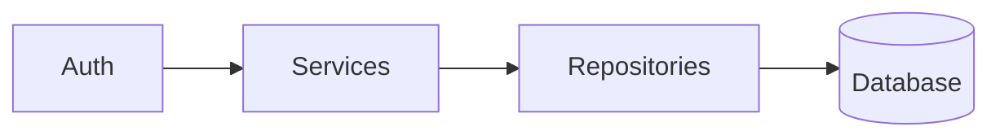

# TEMPLATES — форматы артефактов

Формат важен: по нему строится итоговый ROADMAP **и** работают валидаторы из `scripts/`. Отклонение от схемы → `validate_phase.sh` падает и фаза не считается завершённой.

> **Два обязательных поля:** `confidence_rationale` (для каждого `high` finding) и `exploit_proof` (для каждого `critical` finding). Без них валидатор отклоняет finding.

---

## 1. Finding (запись в `audit/findings.jsonl`)

**Формат:** JSON Lines — одна находка = одна строка валидного JSON. Так можно дописывать по мере работы без перезаписи файла.

### Схема

```json
{
  "id": "F-0042",
  "phase": 4,
  "category": "quality",
  "subcategory": "high-complexity-function",
  "severity": "high",
  "confidence": "high",
  "title": "Функция UserService.handleRequest имеет цикломатическую сложность ~37",
  "location": {
    "file": "src/services/user.ts",
    "symbol": "UserService.handleRequest",
    "lines": "120-298"
  },
  "evidence": "Функция состоит из 178 строк, содержит 8 вложенных if/else, 3 switch, 2 try/catch. Никто из 14 вызывающих не использует более 3 веток поведения.",
  "confidence_rationale": "Прочитал тело функции через find_symbol include_body=true; lines 120-298. Подсчёт ветвей выполнен вручную. Нет рантайм-зависимости — статически очевидно.",
  "impact": "Blast radius 14 символов в 3 кластерах (Auth, API, Notifications). Изменение крайне рискованное. GitNexus impact direction=upstream: 14 вызовов, 6 IMPORTS.",
  "recommendation": "Extract Method (Fowler §6.1): разделить на validateInput, dispatchByType, handleValidation, handleAuthorization. Каждая ≤ 40 строк, ≤ 5 веток.",
  "effort": "M",
  "references": [
    "Fowler, Refactoring 2e, §6.1 Extract Function",
    "McConnell, Code Complete 2e, §7.4 How Long Can a Routine Be?"
  ],
  "related_findings": ["F-0018", "F-0027"],
  "status": "open"
}
```

### Значения полей

- `id` — формат `F-NNNN`, нумерация сквозная через все фазы (F-0001, F-0002, …). **Уникален; валидатор падает при дубликатах.**
- `phase` — номер фазы (0..11). Для подфаз 02b/06b/10a — целое число базовой фазы плюс отметка в `subcategory`.
- `category` — одна из: `architecture`, `dependencies`, `quality`, `error-handling`, `security`, `tests`, `ops`, `performance`, `dx`, `docs`, `data-flow` (для phase 02b), `money-safety` (для phase 06b).
- `subcategory` — короткий kebab-case тег (high-complexity-function, circular-dependency, hardcoded-secret, missing-tests, и т.п.). Свободная форма, но консистентная внутри категории.
- `severity`:
  - `critical` — эксплуатируемая уязвимость, потеря данных, немедленное отключение. **Требует поле `exploit_proof`.**
  - `high` — частые сбои, блокировка разработки, значительный долг.
  - `medium` — неоптимально, но живёт; рефакторинг планомерный.
  - `low` — косметика, улучшения DX.
  - `info` — наблюдение без прямого действия.
- `confidence`:
  - `high` — подтверждено многократными сигналами и ручной проверкой. **Требует поле `confidence_rationale` ≥ 40 символов и непустой `location.lines`.**
  - `medium` — один сильный сигнал, без ручной проверки ИЛИ ручная проверка с оговорками.
  - `low` — гипотеза, нужно валидировать у разработчика.
- `confidence_rationale` (обязательно при `confidence=high`) — одно-два предложения, описывающие **что именно** ты прочитал и **какой инструмент** это подтвердил. Формула: «Прочитал X (где), [запустил Y], не зависит от рантайма потому что Z».
- `exploit_proof` (обязательно при `severity=critical`) — конкретный сценарий эксплуатации: HTTP-вызов / SQL-payload / последовательность шагов, которая ведёт к ущербу. Не «теоретически возможно», а «curl -X POST … → 200 → у пользователя списаны средства».
- `effort` (оценка сверху):
  - `S` — ≤ 1 человеко-день.
  - `M` — 1–5 дней.
  - `L` — 1–3 недели.
  - `XL` — > 3 недель.
- `references` — книга/статья/OWASP и т.п. **Не выдумывай ссылки**. Список допустимых источников — в каждой фазе. Если нет уверенного источника — пропусти поле.
- `status` — `"open"` (по умолчанию) или `"merged"` (когда finding объединён в другой через дедупликацию в фазе 10). Для merged обязательно поле `merged_into: "F-NNNN"`. Не удаляй файл — пометь.

### Правила заполнения

- `evidence` — конкретика, не пересказ. «178 строк, 8 вложенных if» — да. «Слишком сложно» — нет.
- `impact` — цифры из GitNexus (blast radius) или из собственных проверок. Не «вероятно повлияет», а «влияет на X».
- `recommendation` — исполнимое действие, указывающее конкретные символы/файлы. Не «рефакторить».
- `confidence_rationale` нельзя ставить пустым «прочитал». Нужно: «прочитал строки 47-160 в `<path>` через `find_symbol include_body=true`, увидел N веток, нет ввода юзера в опасной операции».
- `exploit_proof` нельзя ставить «легко эксплуатируется». Нужно: конкретный шаг или PoC-команда.
- `location.file` — **один путь**. Если зон много — заведи несколько findings (или укажи каталог + явно отметь в `evidence`, что zoned-finding). Валидатор `check_evidence_citations.py` пытается резолвить путь, и список через запятую часто ломает резолв.
- Никогда не пиши `severity: critical` без `exploit_proof`.

### Пример пустой находки (чтобы прогнать schema):

```json
{"id":"F-0001","phase":0,"category":"ops","subcategory":"tracked-env-symlink","severity":"low","confidence":"high","title":"Файл .env присутствует в репозитории","location":{"file":".env","symbol":null,"lines":"1"},"evidence":"git ls-files показывает .env в индексе; ls -la показывает symlink на apps/bot/.env","confidence_rationale":"Запустил git ls-files и ls -la — оба показывают .env tracked, нет рантайм-зависимости.","impact":"Риск случайной утечки при ротации секретов","recommendation":"Добавить .env в .gitignore; проверить, не попали ли секреты в историю (git log -p .env)","effort":"S","references":["12-factor config"],"related_findings":[],"status":"open"}
```

### Пример critical с exploit_proof:

```json
{"id":"F-0034","phase":6,"category":"security","subcategory":"broken-access-control","severity":"critical","confidence":"high","title":"17 routes /api/cabinet/* без аутентификации","location":{"file":"apps/web/server/api/cabinet/profiles/[id].put.ts","symbol":null,"lines":"17-48"},"evidence":"Прочитан handler — нет вызова getUserSession/requireUserSession. UPDATE user_profiles WHERE id=$1 без user_id фильтра.","confidence_rationale":"Прочитал handler целиком, проверил отсутствие admin-auth middleware на этом пути (admin-auth фильтрует только /admin|/api/admin), grep getUserSession в файле = 0.","exploit_proof":"curl -X PUT https://example.com/api/cabinet/profiles/<victim_id> -H 'Content-Type: application/json' -d '{\"name\":\"pwned\"}' → 200, чужой профиль изменён.","impact":"Любой может удалить/изменить чужой профиль, коллекцию, лайк от чужого user_id","recommendation":"Ввести cabinet-auth middleware + WHERE user_id=$session_user_id во всех write-handlers","effort":"M","references":["OWASP A01:2021","CWE-862"],"related_findings":["F-0035"],"status":"open"}
```

---

## 2. Отчёт фазы (`audit/NN_<name>.md`)

### Шапка (обязательна, всегда)

```markdown
# Фаза NN — <название>

- **Дата завершения фазы:** YYYY-MM-DD
- **Коммит:** <git short hash>
- **Инструменты:** Serena OK | GitNexus OK/DEGRADED
- **Находок добавлено в findings.jsonl:** N (F-XXXX … F-YYYY)
- **Контекст фазы (из memory):** ссылка на `.serena/memories/audit_phase_NN`
```

### Обязательные разделы

1. **Цель фазы** — одно предложение.
2. **Что проверено** — маркированный список пунктов чек-листа с пометкой ✅ / ⚠️ (частично) / ❌ (пропущено + причина).
3. **Ключевые наблюдения** — 3–7 абзацев, плотно, со ссылками на файлы/символы.
4. **Находки этой фазы** — таблица: `id | severity | title`. Детали — в `findings.jsonl`.
5. **Неполные проверки** — если что-то не удалось (нет инструмента, нет доступа), — что именно и почему.
6. **Контрольные вопросы** — письменный ответ на 2 вопроса из файла фазы.
7. **Следующая фаза** — ссылка на следующий файл фазы.

### Длина

**150–400 строк.** `validate_phase.sh` падает на отчётах < 150 строк, **если** в них нет явной секции `## Проверено и чисто` с перечислением пройденных пунктов.

Всё сверх 400 строк — в `audit/evidence/NN_<name>/*`. Там могут быть: mermaid-диаграммы, большие таблицы, фрагменты кода длиннее 30 строк.

### Раздел «Проверено и чисто» (опциональный, но защищает от gate-fail)

Если в фазе действительно мало findings или короткий отчёт — добавь раздел:

```markdown
## Проверено и чисто

Следующие пункты чек-листа пройдены и подтверждённо чистые:
- A03 Injection — параметризация SQL везде ($1,$2…), grep по `eval|new Function|exec(` с user input → 0 матчей.
- … (минимум 5 пунктов с конкретикой; «всё ок» — не считается)
```

---

## 3. Memory-формат (`.serena/memories/audit_phase_NN`)

Короткая сводка — 10–20 строк. Чтобы новая сессия могла «подхватить» без чтения всего отчёта.

```markdown
# Phase NN memory

Phase name: <имя>
Completed: YYYY-MM-DD HH:MM
Commit: <hash>

Key outputs:
- <главный результат 1>
- <главный результат 2>
- <главный результат 3>

Findings added: F-XXXX to F-YYYY (count)

Open questions (to revisit later):
- <вопрос>

Next phase: phase_NN+1_<name>.md
```

---

## 4. Memory прогресса (`.serena/memories/audit_progress`)

Перезаписывается каждой фазой. Единый актуальный статус.

```markdown
# Audit progress

Last updated: YYYY-MM-DD HH:MM
Project path: <абсолютный путь>
Commit: <hash>
Branch: <branch>

Completed phases:
- [x] 00 setup
- [x] 01 inventory
- [ ] 02 architecture  ← CURRENT
- [ ] 03 dependencies
- [ ] ...
- [ ] 10 synthesis

Findings so far: N
```

---

## 5. Mermaid-диаграммы

Где нужны диаграммы (фазы 02, 10), используй Mermaid прямо в markdown:

````markdown

````

---

## 6. Проверка формата в конце каждой фазы (детерминированная)

Перед завершением фазы **обязательно** запусти валидатор:

```bash
bash audit_pipeline/scripts/validate_phase.sh NN
```

Скрипт проверяет всё, что раньше делалось «глазами»:
- JSON-валидность `findings.jsonl`
- Минимальная квота новых findings (с учётом размера проекта)
- 7 обязательных разделов в отчёте
- Длина ≥ 150 строк (или есть «Проверено и чисто»)
- Все обязательные evidence-файлы фазы созданы (≥ 2)
- Per-phase confidence не моноблок (для ≥ 3 findings)
- Каждый `confidence: high` имеет `confidence_rationale ≥ 40` символов и непустой `location.lines`
- Каждый `severity: critical` имеет `exploit_proof ≥ 40` символов

**Если скрипт упал — фаза НЕ считается завершённой.** Не переходи к следующей.

---

## 7. Финальный артефакт — `audit/_meta.json`

Генерируется автоматически через `scripts/generate_meta_json.py` (вызывается из `finalize.sh`). Машинная сводка для CI/dashboards:

```json
{
  "generator": "codebase-audit",
  "generated_at": "2026-04-23T15:00:00+00:00",
  "project": {"baseline_commit": "...", "size": "M", "branch": "main"},
  "findings": {
    "total": 49,
    "by_confidence": {"high": 39, "medium": 10},
    "by_severity":   {"critical": 4, "high": 7, "medium": 25, "low": 13}
  },
  "phases": { "00": {...}, ..., "10a": {...} },
  "tools_used": ["cloc","npm_audit","gitleaks","gitleaks_history","coverage"],
  "tools_skipped": [],
  "violations": [],
  "verdict": "pass"
}
```

`verdict: pass` означает все gates пройдены. `fail` — список нарушений в `violations`.

---

## 8. Финальные артефакты

В дополнение к отчётам фаз и ROADMAP, корень `audit/` содержит:

| Файл | Назначение | Создаётся в |
|------|------------|-------------|
| `_meta.json` | Машинная сводка | `finalize.sh` |
| `_known_unknowns.md` | Список вопросов, на которые аудит не ответил, с указанием инструмента-закрывалки | Phase 10a |
| `_adversary_review.md` | Самокритичный обзор «10 причин не доверять этому аудиту» | Phase 10a |
| `ROADMAP.md` | Главный результат | Phase 10 |

---

Теперь перейди к `phases/phase_00_setup.md`.
