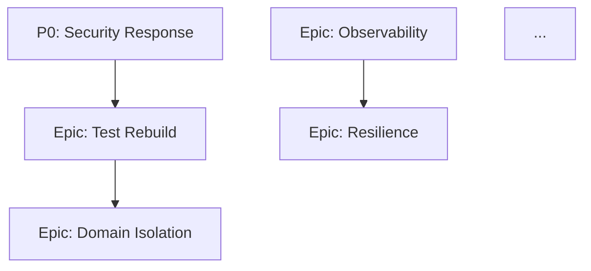

# PHASE 10 — SYNTHESIS & ROADMAP

**Цель:** Свести всё в один применимый приоритизированный план улучшений. Это финальный артефакт пайплайна, ради которого всё затевалось.

**Источники:**
- Feathers, *Working Effectively with Legacy Code* — «seams», пошаговая эволюция легаси.
- Fowler, *Refactoring* 2e — механика безопасных изменений.
- Forsgren/Humble/Kim, *Accelerate* — capability blocks, а не отдельные тикеты.
- Kim, *The Phoenix Project* / *Visible Ops* — «theory of constraints» в IT.
- Cockburn, *Agile Software Development* — iterative incremental delivery.

---

## 1. Входы
- ВСЕ предыдущие отчёты: `audit/00_setup.md` … `audit/09_performance.md`.
- `audit/findings.jsonl` — полный список находок.
- `.serena/memories/audit_phase_00` … `audit_phase_09`.

## 2. Процесс синтеза

### 2.1. Дедупликация findings
- [ ] Прочитай `findings.jsonl` целиком.
- [ ] Группировка: одна и та же проблема могла попасть в несколько фаз (например, sensitive logging = фаза 06 + 08). Сверь по `location`.
- [ ] Объедини дубликаты в один, в `related_findings` укажи удалённые ID для traceability. **Не удаляй файл** — пометь дубликаты `status: merged` и поле `merged_into: F-XXXX`.

### 2.2. Валидация severities
Перепроверь severity каждого critical/high с учётом полной картины:
- Critical secret, но репозиторий приватный и только команда из 3 человек — всё равно critical (рабочий процесс должен быть чистым), но в ROADMAP примечание.
- High на dead code (если GitNexus показал 0 callers) — понизить до `low`.
- Medium на центральный символ (из фазы 02) — повысить до `high`.

### 2.3. Сведение в матрицу severity × effort
Раздели findings по квадрантам:

|             | Effort S   | Effort M   | Effort L   | Effort XL  |
|-------------|-----------|-----------|-----------|-----------|
| **Critical**| Now       | Now       | Now       | Split!    |
| **High**    | Quick win | Sprint    | Epic      | Epic      |
| **Medium**  | Sprint    | Quarter   | Epic      | Backlog   |
| **Low**     | Cleanup   | Cleanup   | Backlog   | Don't do  |

**Critical + XL** — если нашёл такое, значит надо **разбить**. Одну XL-critical правку не делают — она растягивается на кварталы и всё это время система уязвима. Найди инкрементальную стратегию (см. Feathers — Sprout Method / Sprout Class / Wrap Method / Strangler Fig).

### 2.4. Группировка в эпики
Findings с общей темой объединяй в тематические **эпики**. Типичные эпики:

- **Immediate Security Response** — ротация секретов, пинг-фиксы OWASP A01/A03.
- **Observability Baseline** — структурные логи, correlation ID, 4 golden signals, tracing на критичные операции.
- **Test Pyramid Rebuild** — покрытие центральных символов + error branches + CI integration.
- **Domain Layer Isolation** — чистка слоистости, убрать infra-импорты из domain.
- **Dependency Freshness** — lockfiles, SCA в CI, план регулярного обновления.
- **Resilience Baseline** — timeouts everywhere, circuit breaker на критичные downstream, idempotency на критичные API.
- **Documentation Kickstart** — ARCHITECTURE.md, ADRs для принятых решений, README раздел для контрибьюторов.
- **Performance Hotfixes** — N+1, sync I/O в async, unbounded caches.
- **Release Discipline** — linters/typecheck в CI, pre-commit, conventional commits.
- **Legacy Cleanup** — dead code, старые TODO, закомментированный код, мёртвые тесты.

Каждый эпик = коллекция findings + цель + критерии готовности + оценка.

### 2.5. Построение фаз ROADMAP

**Phase 0 — CRITICAL (в течение 1–7 дней):**
- Всё `critical` findings. Должно быть быстро выполнимо. Если нет — разбивай.
- Типичное содержание: ротация секретов, closing open vulnerabilities уровня A1-A3 OWASP, восстановление lockfile.

**Phase 1 — QUICK WINS (в течение 1 спринта = 2 недели):**
- `high` + `S`/`M` effort.
- Очевидные, не меняющие архитектуру.

**Phase 2 — QUARTERLY EPICS (в течение квартала):**
- Эпики с `M`/`L` effort, ценность высокая.
- Максимум 3–5 одновременно (не надо всё сразу — Accelerate §theory of constraints).

**Phase 3 — STRATEGIC / LONG-TERM (backlog, 6+ месяцев):**
- `L`/`XL` эпики, архитектурные изменения.
- Должны иметь явный trigger: «когда произойдёт X, начинать».

**Phase 4 — ANTI-ROADMAP (что НЕ делать):**
- Из Ousterhout §5 — «Working code isn't enough». Заманчивые, но вредные идеи.
- Типичные:
  - «Перепишем всё с нуля» — почти всегда проигрышная стратегия (Spolsky).
  - «Перейдём на микросервисы» — без зрелой observability и CD это регрессия.
  - «Добавим ещё один linter» — без применения в CI бесполезно.
  - Миграция на модный фреймворк «потому что новее» без конкретной цели.
  - Добавление абстракции под один кейс (premature abstraction).

Agent должен сам определить anti-items на основе того, что видел — например, если фаза 07 показала, что пирамида e2e-heavy, то anti-item: «не добавлять новые e2e, пока не вырастим unit-слой».

### 2.6. Критерии готовности каждого эпика

Каждый эпик должен иметь **измеримые** acceptance criteria. Примеры:

- Test Pyramid Rebuild: «coverage центральных символов (из фазы 02) ≥ 80% branch coverage + каждый central symbol имеет ≥ 1 error-path test».
- Observability Baseline: «каждый request в API-гейтвее имеет correlation ID, протягивающийся во все downstream-вызовы; собираются 4 golden signals с dashboard в Grafana/Datadog».
- Resilience Baseline: «все внешние HTTP-вызовы имеют configured timeout + retry with exponential backoff; критичные вызовы обёрнуты в circuit breaker».

«Улучшить Х» — не критерий. «Х измеряется как У и стало ≥ Z» — критерий.

### 2.7. Метрики успеха ROADMAP в целом
Определи baseline сейчас и целевое значение через 3 месяца:
- Число critical findings: сейчас N → цель 0.
- Число high findings: N → снизить на 50%.
- Test coverage центральных символов: N% → 80%.
- CI time: X min → Y min.
- DORA 4 (если есть возможность измерить): — baseline, target.
- Complexity p95 (cyclomatic) топ-50 файлов: N → M.

### 2.8. Seam-анализ для L/XL правок
Для каждого L/XL эпика — укажи **seam point** (Feathers) — где безопасно вмешаться.

Пример: «Domain Layer Isolation»:
- Seam: интерфейс `UserRepository` уже существует в `domain/interfaces/`, но domain импортирует конкретный `PostgresUserRepository`. Исправление: domain импортирует только интерфейс, fabric DI собирает в composition root.
- Риск: низкий, потому что seam уже частично есть.
- Incremental strategy: по одному репозиторию за раз, PR-per-entity.

### 2.9. Зависимости между эпиками
- Security response → ничто не должно блокировать.
- Test Pyramid Rebuild ДО других рефакторингов (Feathers: нельзя рефакторить без тестов-защитной сетки).
- Observability Baseline ДО Resilience Baseline (нельзя починить таймауты, не видя их).
- Dependency Freshness ДО major upgrades (обновление одной зависимости без lockfile = roulette).

Построй DAG зависимостей эпиков (Mermaid).

## 3. Артефакт — `audit/ROADMAP.md` (главный результат пайплайна)

### Обязательная структура

```markdown
# ROADMAP улучшений кодовой базы

**Проект:** <имя>
**Дата аудита:** YYYY-MM-DD
**Коммит baseline:** <hash>
**Объём:** <N> LOC, <K> языков
**Размер-категория:** <XS/S/M/L/XL>
**Всего findings:** <N> (C: <N>, H: <N>, M: <N>, L: <N>, I: <N>)

---

## 🎯 Executive summary
Один абзац (6–10 предложений):
- Что это за система (вывод из аудита).
- Её общее состояние (одно из: healthy, stable with debt, risky, critical).
- Top-3 риска.
- Top-3 сильных стороны (важно! не только критика).
- Общий уровень инвестиций, необходимых для доведения до «good».

---

## 📊 Метрики-сводка
Таблица: категория findings, количество, тренд (если была предыдущая итерация — пометить).

Плюс таблица baseline → target по метрикам успеха.

---

## 🔥 Phase 0 — Critical (сейчас, в течение 7 дней)
Список конкретных задач с ID findings. Формат:

### P0.1 <title>
- **Findings:** F-XXXX, F-YYYY
- **Impact:** <что сломается/утекёт/ухудшится, если не сделать>
- **Action:** <конкретные шаги>
- **Effort:** S/M
- **Owner-type:** security / backend / infra
- **Verification:** <как проверить, что сделано>

Повторить для каждой P0-задачи.

---

## ⚡ Phase 1 — Quick wins (текущий спринт, 2 недели)
Тот же формат.

---

## 📦 Phase 2 — Quarterly epics
Каждый эпик — отдельный подраздел:

### Epic A — <название>
- **Цель:** 1-2 предложения.
- **Обоснование:** почему важно (ссылка на фазы аудита).
- **Findings inside:** F-XXXX, F-YYYY, F-ZZZZ (total <N>).
- **Критерии готовности:** 3–5 измеримых пунктов.
- **Estimated effort:** <person-weeks>.
- **Dependencies:** <другие эпики или условия>.
- **Seam point / стратегия:** <как безопасно начать>.
- **Rollout plan:** 3–5 инкрементальных шагов.

---

## 🔭 Phase 3 — Strategic (6+ месяцев)
Тот же формат, но оценки могут быть грубее. Обязательно: trigger condition («начать, когда…»).

---

## 🚫 Phase 4 — Anti-roadmap (что НЕ делать)
Список + обоснование каждого пункта.

---

## 🔗 Dependency DAG эпиков
Mermaid:


---

## 📏 Метрики успеха
Таблица:
| Метрика | Baseline (сейчас) | Target 3мес | Target 6мес |
|---------|---|---|---|
| Critical findings | <N> | 0 | 0 |
| Test coverage (central symbols) | <N%> | 80% | 90% |
| Bundle size (frontend, if applicable) | <KB> | <target> | <target> |
| Cyclomatic complexity p95 | <N> | <target> | <target> |
| ... | ... | ... | ... |

---

## 📚 Приложения
- [00 Setup](./00_setup.md)
- [01 Inventory](./01_inventory.md)
- ...
- [09 Performance](./09_performance.md)
- [findings.jsonl](./findings.jsonl)

---

## 💬 Примечания для команды
- Дискуссионные пункты, требующие интервью с разработчиками.
- Places в коде, где агент был не уверен и рекомендует ручную проверку.
- Контекст, который агент мог не учесть (бизнес-приоритеты, SLA, regulatory).
```

## 4. Контрольные проверки перед завершением

- [ ] **Количество эпиков разумное.** < 3 эпика — ты слишком обобщил; > 10 — разбил слишком мелко. Золотая середина 5–8.
- [ ] **Каждая Phase 0 задача выполнима за ≤ 3 дня.** Если нет — разбей.
- [ ] **У каждого эпика есть measurable acceptance criteria.** Не «улучшить», а «достичь метрики X».
- [ ] **Dependency DAG не имеет циклов.**
- [ ] **Anti-roadmap не пустой.** Если совсем нечего запретить — ты не достаточно смело смотрел.
- [ ] **Executive summary читается за 60 секунд.** Попробуй на себе.

## 5. Финальная обязанность

- [ ] Вызови `think_about_whether_you_are_done`. Если есть сомнения — какая фаза могла что-то упустить — опционально вернись и дополни.
- [ ] Обнови `.serena/memories/audit_progress` — пометь все фазы как completed.
- [ ] Создай `.serena/memories/audit_final_summary`:

```markdown
# Audit final summary
Completed: YYYY-MM-DD

Project: <имя>
Baseline commit: <hash>
Overall state: <healthy/stable with debt/risky/critical>

Top 3 risks:
1. ...
2. ...
3. ...

Top 3 strengths:
1. ...
2. ...
3. ...

Recommended first action: <1 предложение>

Total findings: <N>
Epics in roadmap: <N>
```

## 6. Отчёт пользователю (финальный)

Это последнее сообщение агента. Формат — **tl;dr из 5-7 пунктов** + ссылки на ключевые артефакты. Никакого маркетингового тона, честно.

**Шаблон:**

> **Аудит завершён.** Проект: `<имя>`, baseline `<commit>`.
>
> **Общее состояние:** <healthy/stable with debt/risky/critical>.
>
> **Ключевые выводы:**
> 1. <самое важное из security/архитектуры/…>
> 2. <следующее по важности>
> 3. ...
> 5. ...
>
> **Первые действия:** <перечислить 2-3 задачи Phase 0>
>
> **Главный документ:** `audit/ROADMAP.md` — там 5 фаз ROADMAP, DAG эпиков и метрики успеха.
> **Детали:** отчёты `audit/01_inventory.md` … `audit/09_performance.md`.
> **Всего находок:** N (C: N, H: N, M: N, L: N).
>
> Рекомендую сначала обсудить Executive summary и Phase 0 с командой, затем — приоритеты Phase 2 эпиков.

**Конец пайплайна.**
