<div align="center">

  <h1>⚡ Node.js Audit Pipeline <code>v1</code></h1>

  <p>
    <b>Быстрый автономный аудит JS/TS проекта за один прогон Claude Code.</b><br/>
    Один промт · 10 фаз · 30–90 минут · без MCP и без установки в проект.
  </p>

  <p>
    
    
    
    
    
    
    
    
  </p>

  <p>
    <a href="../README.md">← Назад к Audit Pipelines</a> ·
    <a href="./MASTER_PROMPT.md">📋 MASTER_PROMPT</a> ·
    <a href="./AUDIT.md">AUDIT.md</a> ·
    <a href="../frontend">Frontend (deep)</a> ·
    <a href="../codebase">Codebase (universal)</a>
  </p>

</div>

<br/>

> **Идея.** Ты вставляешь один промт в новую сессию Claude Code в корне
> своего JS/TS проекта — Claude сам идёт по 10 фазам, ничего не спрашивает,
> и через ~час выдаёт `FINAL-REPORT.md` с готовыми промтами для фиксов и
> `_meta.json` для CI.
>
> Никаких MCP-серверов, никаких установок в `package.json`, никаких
> манифестов. Все инструменты — через `npx --yes`.

---

## Для кого это

> - У тебя **JS/TS проект** — Node-бэкенд, React/Next-фронт, монорепо, бот, CLI
> - Хочешь **быстрый первый проход** перед глубоким аудитом
> - Не хочешь возиться с установкой Serena, GitNexus, Python-зависимостей
> - Нужен **`_meta.json` для CI** — pass/fail по объективным метрикам
> - Готовишь регулярный (раз в квартал) health-check проекта

Если нужен глубокий аудит React/Next.js с навигацией по графу кода →
[`frontend/`](../frontend). Если бэкенд с деньгами/транзакциями и нужен
adversary review → [`codebase/`](../codebase). Если БД-специфика →
[`database-audit/`](../database-audit).

---

## Чем это отличается от других пайплайнов

| | nodejs-audit | frontend | codebase | database-audit |
|---|---|---|---|---|
| **Стек** | JS/TS (full-stack) | React/Next.js | Любой (Py/Go/TS/Java/Rust) | Любой с БД |
| **Глубина** | Поверхностная (grep-based) | Средняя | Глубокая (LSP+граф) | Глубокая (manifest+30 детекторов) |
| **MCP-серверы** | ❌ не нужны | Serena + GitNexus | Serena + GitNexus | Serena + GitNexus |
| **Установка в проект** | ❌ нет (всё `npx --yes`) | nothing | Python deps | Python deps |
| **Время прогона** | 30–90 мин | 2–3 часа | 1–4 часа | 30 мин – 2 часа |
| **Запуск** | 1 команда (paste) | 1 команда + MCP | многошаговый | 1 команда (manifest-driven) |
| **CI integration** | `_meta.json` | через roadmap | `_meta.json` | `_meta.json` |
| **Self-audit / hard gates** | ❌ | ❌ | ✅ | ✅ |

**Вывод:** `nodejs-audit/` — это **точка входа** для JS/TS проектов. Запусти
сначала, получи карту, потом решай — нужно ли копать глубже через `frontend/`
или `codebase/`.

---

## Что находит этот пайплайн

### 🔴 Critical / High

| Что | Как находим |
|---|---|
| SQL injection через `query(`...${var}\`)` | grep `query\(.*\$\{\|raw\(.*\$\{` |
| XSS через `dangerouslySetInnerHTML` / `innerHTML=` | grep + Vue `v-html` |
| Command injection через `exec(`/`spawn(req.…)` | grep с фильтром req.* |
| CORS `*` или `Access-Control-Allow-Origin: *` | grep |
| Слабая криптография (md5/sha1 для паролей) | grep + cross-check `bcrypt/argon2` |
| Секреты в `.env` в git | `git ls-files \| grep -E '^\.env'` |
| Hardcoded API keys / tokens в исходниках | regex с фильтром тестов и `process.env` |
| `npm audit` critical/high CVEs | `npm audit --json` |
| Нет rate-limiting на публичных endpoints | grep `express-rate-limit\|fastify-rate` |
| Логирование PII / паролей / токенов | grep `log.*req\.body\|log.*password` |

### 🟡 Performance / Architecture

| Что | Как находим |
|---|---|
| N+1 queries (`for { await fetch }`, `.map(async`) | grep + ручная вычитка топ-3 |
| Sync I/O (`readFileSync`, `execSync`) на хот-пути | grep |
| `setInterval` без парного `clearInterval` (утечки) | grep cross-ref |
| Циклические импорты | `madge --circular` |
| Топ-25 самых длинных файлов | `find + wc -l + sort -rn` |
| Нарушения слоёв (ORM в контроллерах) | grep `prisma\.\|knex\.\|db\.query` в `controllers/` |
| ESLint топ-10 правил + топ-10 файлов | `eslint --format json` |
| TypeScript ошибки по категориям (TS2xxx, TS7xxx) | `tsc --noEmit` |

### 🟢 Quality / DX / AI-readability

| Что | Как находим |
|---|---|
| Покрытие JSDoc на публичных функциях | соотношение `^export function` к `^/**` |
| Однородность стиля (await vs .then, kebab vs camelCase) | grep счётчики |
| Магические числа / строки | regex с фильтром тестов |
| Закомментированный код (TODO/FIXME/HACK) | grep |
| AGENTS.md / CLAUDE.md / README качество | wc + ручная оценка |
| Husky + lint-staged + CI workflows | `ls .husky/`, `ls .github/workflows/` |
| Path aliases в tsconfig | grep `"paths":` |
| TypeScript strict mode | grep `"strict":` |

---

## Как работает анализ

```mermaid
flowchart LR
    A[Phase 0<br/>Bootstrap] --> B[Phase 1<br/>Recon]
    B --> C[Phase 2<br/>Deterministic]
    C --> D[Phase 3<br/>Architecture]
    D --> E[Phase 4<br/>Readability]
    E --> F[Phase 5<br/>Security]
    F --> G[Phase 6<br/>Performance]
    G --> H[Phase 7<br/>Observability]
    H --> I[Phase 8<br/>AI-readability]
    I --> J[Phase 9<br/>Final synthesis]
    J --> K[FINAL-REPORT.md<br/>+ _meta.json]

    style A fill:#fde7c8,stroke:#d97757,color:#000
    style C fill:#d4e6f1,stroke:#2c3e50,color:#000
    style F fill:#f5d5d5,stroke:#c0392b,color:#000
    style J fill:#d5f5e3,stroke:#27ae60,color:#000
    style K fill:#fff2a8,stroke:#b7950b,color:#000
```



**Принцип каждой фазы:**

1. Запустить grep/npx-команды → сырые логи в `reports/raw/`
2. Извлечь ключевые числа и паттерны
3. Записать структурированный отчёт в `reports/0N-*.md`
4. **Не накапливать в контексте** — следующая фаза читает только нужные файлы из `reports/`

**Финальная фаза 9** читает только `reports/0N-*.md` (не сам код проекта)
и собирает FINAL-REPORT.md + `_meta.json`. Это критично для экономии
контекста на больших проектах.

---

## Файловая структура

```
project/
└── nodejs-audit/                ← всё внутри одной папки
    │
    │── pipeline (committed) ──────────────────────────
    ├── README.md                 ← ты здесь
    ├── MASTER_PROMPT.md          ← paste-ready промт ⭐
    ├── AUDIT.md                  ← полная спека 10 фаз
    │
    ├── 00-bootstrap.md           ← interactive mode (по 1 фазе за прогон)
    ├── 01-recon.md               ← (альтернатива AUDIT.md если хочется
    ├── 02-deterministic.md           контролировать каждую фазу руками)
    ├── 03-architecture.md
    ├── 04-readability.md
    ├── 05-security.md
    ├── 06-performance.md
    ├── 07-observability.md
    ├── 08-ai-readability.md
    ├── 09-final-report.md
    ├── 10-fix-loop.md            ← цикл применения фиксов после аудита
    │
    ├── configs/                  ← готовые конфиги для проекта
    │   ├── prettierrc.json
    │   ├── eslint.config.js
    │   ├── tsconfig.strict.json
    │   └── github-actions-audit.yml
    │
    ├── templates/
    │   ├── AGENTS.md.template
    │   └── findings-template.md
    │
    │── runtime (gitignored) ──────────────────────────
    └── reports/
        ├── FINAL-REPORT.md       ← главный артефакт (для владельца)
        ├── _meta.json            ← машинная сводка (для CI)
        ├── 00-bootstrap.md       ← по фазам, для отладки
        ├── 01-recon.md
        ├── ... (02..08)
        ├── errors.log            ← что не удалось проверить
        └── raw/                  ← сырые логи команд (eslint.json, ...)
```

---

## Quick start

### Автономный режим (рекомендуется) ⭐

**Один промт — один аргумент.** Открой Claude Code и вставь:

```
Прочитай /home/ubuntu/projects/audit-pipelines/nodejs-audit/MASTER_PROMPT.md
и выполни полный аудит проекта:

PROJECT_PATH=/home/ubuntu/apps/<project_name>
```

Всё. От тебя — только путь к проекту. ИИ сам:

- скопирует `nodejs-audit/` внутрь твоего проекта
- определит `npm/yarn/pnpm/bun`, TS/JS, размер
- пройдёт все 10 фаз через `npx --yes`
- запишет `FINAL-REPORT.md` + `_meta.json`
- выведет финальное сообщение с verdict и топ-3 проблемами

Через 30–90 минут:

```bash
cat <PROJECT_PATH>/nodejs-audit/reports/FINAL-REPORT.md
jq . <PROJECT_PATH>/nodejs-audit/reports/_meta.json
```

Полный контракт автономности — в [`MASTER_PROMPT.md`](./MASTER_PROMPT.md).

### Manual mode (если хочется контроля)

Скопируй пайплайн в проект руками и запускай по одной фазе:

```bash
cp -r /home/ubuntu/projects/audit-pipelines/nodejs-audit /your/project/
```

Потом в Claude Code:

```
"Прочитай nodejs-audit/00-bootstrap.md и выполни. Создай reports/00-bootstrap.md."
```

Потом то же для `01-recon.md`, `02-deterministic.md` и так далее. Это даёт
возможность вручную ревьюить каждую фазу перед следующей. Дольше, но
прозрачнее.

---

## Что получишь на выходе

### `FINAL-REPORT.md`

```markdown
# Финальный отчёт аудита
**Проект:** my-saas
**Дата:** 2026-05-01

## Executive Summary
[5-7 предложений простым языком, для не-программиста.]

## Общая оценка: 142 / 240
| Слой | Оценка | Статус |
|------|--------|--------|
| Форматирование | 7/10 | ⚠️ |
| Линтинг | 4/10 | ❌ |
| Типизация | 8/10 | ✅ |
| Тесты | 3/10 | ❌ |
| Безопасность | 18/30 | ⚠️ |
| ... | ... | ... |

## ТОП-10 критических проблем
### #1: SQL injection в /api/search
- Где: src/api/search.ts:42
- Серьёзность: Critical
- Готовый промт: см. #1 ниже

## Roadmap исправлений
### Неделя 1 (P0): что фиксить сегодня
- [ ] SQL injection в /api/search
- [ ] Hardcoded JWT secret в src/auth.ts:18
- [ ] CORS * на /api/* endpoints

## Все готовые промты (сквозная нумерация)
### Промт #1: Зафиксить SQL injection в /api/search
[Самодостаточный текст промта для Claude Code.]
```

### `_meta.json` (для CI)

```json
{
  "version": "autonomous-v1",
  "generated_at": "2026-05-01T14:23:11Z",
  "project": {
    "name": "my-saas",
    "package_manager": "pnpm",
    "typescript": true,
    "src_files": 247
  },
  "scores": {
    "total": 142,
    "max_total": 240,
    "security": 18,
    "architecture": 32
  },
  "verdict": "fail",
  "counts": {
    "critical": 2,
    "high": 7,
    "medium": 14,
    "low": 3
  },
  "blockers": [
    "SQL injection в src/api/search.ts:42",
    "Hardcoded JWT secret в src/auth.ts:18"
  ],
  "phases_completed": [0, 1, 2, 3, 4, 5, 6, 7, 8, 9],
  "phases_failed": []
}
```

**Verdict-логика:**
- `fail` — есть critical, или фаза 9 не дошла
- `warn` — нет critical, но есть high, или score < 120/240
- `pass` — нет critical, нет high, score ≥ 120/240

---

## CI integration

```yaml
- name: Run nodejs-audit
  run: |
    claude --print "$(awk '/^```$/{f=!f;next} f && /Прочитай nodejs-audit/{p=1} p{print}' nodejs-audit/MASTER_PROMPT.md)"

- name: Check verdict
  run: |
    verdict=$(jq -r .verdict nodejs-audit/reports/_meta.json)
    if [ "$verdict" = "fail" ]; then
      echo "::error::Audit verdict=fail"
      jq -r '.blockers[]' nodejs-audit/reports/_meta.json
      exit 1
    fi

- name: Upload report
  if: always()
  uses: actions/upload-artifact@v4
  with:
    name: audit-report
    path: nodejs-audit/reports/
    retention-days: 30
```

---

## Что НЕ делает пайплайн

- Не меняет код проекта (read-only)
- Не устанавливает пакеты в твой `package.json` (всё через `npx --yes`)
- Не делает коммиты, не пушит, не создаёт PR
- Не запускает Lighthouse / реальный bundle build / нагрузочное тестирование
  (это слишком долго для автономного запуска — запускай отдельно)
- Не делает penetration testing — экспресс-проход OWASP, не замена
  настоящему security audit
- Не использует MCP-серверы (Serena, GitNexus) — для глубокой
  семантической навигации см. [`codebase/`](../codebase) или
  [`database-audit/`](../database-audit)

---

## После аудита: цикл фиксов

В `FINAL-REPORT.md` будут пронумерованные промты. Применяй по одному в
**новой сессии**:

```bash
git checkout -b fix/audit-1
```

```
В Claude Code:
"Прочитай nodejs-audit/reports/FINAL-REPORT.md и выполни промт #1.
Делай минимальные изменения, по одному коммиту на логический шаг.
После каждого коммита запускай тесты. Если что-то ломается —
откатывайся к рабочему состоянию."
```

Один промт = одна сессия = одна ветка = один merge. Подробнее — в
[`10-fix-loop.md`](./10-fix-loop.md).

---

## Повторный аудит

Через 3 месяца запусти `MASTER_PROMPT.md` повторно. Сохрани старый отчёт:

```bash
mkdir -p nodejs-audit/reports/archive/$(date +%Y-%m-%d)
mv nodejs-audit/reports/{FINAL-REPORT.md,_meta.json} \
   nodejs-audit/reports/archive/$(date +%Y-%m-%d)/
```

Сравни `_meta.json.scores.total` до/после — увидишь динамику.

---

## Известные ограничения

| Ограничение | Что это значит | Что делать |
|---|---|---|
| Поверхностный grep-based анализ | Может пропустить семантические проблемы (особенно cross-file refactor) | Запусти `codebase/` для глубокого прохода |
| Нет проверки runtime-поведения | Утечки памяти / race conditions ловятся только статически | Используй профилировщик отдельно |
| Не понимает доменную логику | «Money invariants» не проверяются | Если важно — `codebase/` или `database-audit/` |
| `_meta.json` создаётся ИИ — могут быть ошибки в JSON | Иногда нужно чинить руками | `jq . _meta.json` для валидации перед CI |
| OWASP экспресс-проход, не pentest | Не находит логические уязвимости (broken access control деталей) | `security-audit` skill отдельно |

Эти ограничения — цена за **30-минутный автономный запуск без MCP**. Для
ревью продакшн-релиза перед деплоем используй `codebase/` или ручной аудит.

---

## Литература (на чём построено)

- Robert C. Martin — *Clean Architecture*, *Clean Code*
- Martin Fowler — *Refactoring*
- Michael Feathers — *Working Effectively with Legacy Code*
- John Ousterhout — *A Philosophy of Software Design*
- OWASP Top 10 (2021/2025)
- Web.dev — Core Web Vitals
- Google SRE Book — observability столпы
- Anthropic — *Claude Code best practices*

---

<div align="center">

[← Назад к Audit Pipelines](../README.md) ·
[📋 MASTER_PROMPT](./MASTER_PROMPT.md) ·
[AUDIT.md](./AUDIT.md)

</div>
