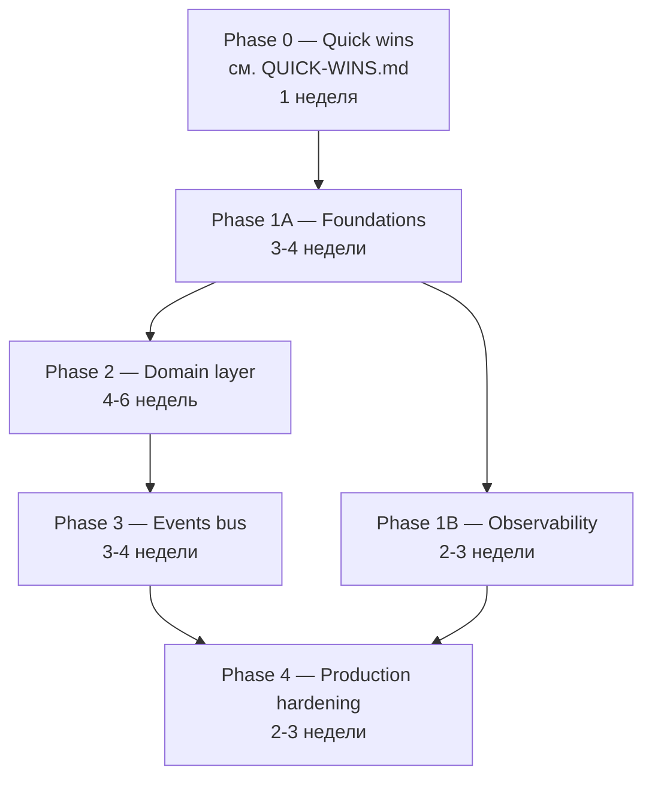

# Roadmap to Production-Grade (1-3 months)

> **Source:** `FINAL-REPORT.md` + `ADR-DRAFTS/` + `REFACTORING/`.
> **Goal:** перевести проект из current (X/Y) в production-ready по 8 pillars Susan Fowler.

---

## Зависимости (DAG)

---

## Phase 0 — Quick Wins (1 неделя)

См. [QUICK-WINS.md](./QUICK-WINS.md). **Префаза:** все P0 и P1 hygiene должны быть закрыты до старта Phase 1.

---

## Phase 1A — Foundations (3-4 недели)

### Цель
<Высокоуровневая цель в одно предложение.>

### ADR в фокусе
- ADR-XXX — <название> (см. `ADR-DRAFTS/ADR-XXX-<slug>.md`)
- ADR-YYY — <название>

### Refactoring targets
- `REFACTORING/<slug>.md` — <таргет>

### Plan (атомарные шаги)
1. ...
2. ...
3. ...

### Definition of Done
- [ ] ADR-XXX в `wiki/decisions.md` (с file:line evidence).
- [ ] ADR-YYY в `wiki/decisions.md`.
- [ ] Все fitness tests из ADR — зелёные в CI.
- [ ] `wiki/log.md` имеет entry «Phase 1A complete».
- [ ] `npm run test` зелёный, coverage не упало.
- [ ] Production deploy без regression на `/health` `/ready`.
- [ ] Документация на 1 разворот: «как добавить X после этой фазы».

---

## Phase 1B — Observability (2-3 недели)

### ADR в фокусе
- ADR-OBS-001 — <Sentry / OpenTelemetry / SLO dashboards>

### Plan
1. ...
2. ...

### Definition of Done
- [ ] Trace context propagation между всеми entry-process'ами.
- [ ] SLO dashboards активны (хотя бы для denial/availability/latency).
- [ ] Alerting rules в Prometheus/Grafana.

---

## Phase 2 — Domain layer (4-6 недель)

### Цель
Перейти от anemic FSD к rich domain (Evans §6).

### ADR в фокусе
- ADR-DOMAIN — <introduce domain layer>
- ADR-RESULT — `Result<T, E>` error monad

### Refactoring targets
- ...

### Plan
1. Создать `packages/<project>-domain/`.
2. Перенести primitives (IDs, money, language).
3. Перенести 1 aggregate (тестовый, например `User`).
4. Создать application layer (use cases) для операций над `User`.
5. Перенести следующий aggregate.
6. ...

### Definition of Done
- [ ] `packages/<project>-domain/` собирается.
- [ ] Все domain-функции pure (без I/O).
- [ ] Use cases возвращают `Result<T, E>`, не throw.
- [ ] Fitness test: «domain has no infrastructure imports».

---

## Phase 3 — Events bus (3-4 недели)

### Цель
Domain-events publish/subscribe для разрыва direct coupling между фичами (Vernon IDDD §8).

### ADR в фокусе
- ADR-EVENTS — <typed event bus>
- ADR-OUTBOX — <transactional outbox для at-least-once>

---

## Phase 4 — Production hardening (2-3 недели)

### ADR в фокусе
- ADR-FEATURE-FLAGS
- ADR-ZERO-DOWNTIME-MIGRATIONS

---

## Глобальные Definition of Done на каждый шаг

1. **ADR в `wiki/decisions.md`** с file:line evidence + trade-off matrix.
2. **Plan-файл** помечен `status: completed YYYY-MM-DD`.
3. **Все fitness-tests зелёные** (CI gate).
4. **`wiki/components/<area>.md`** обновлён; `wiki/log.md` имеет entry.
5. **`npm test`** зелёный; coverage не упало.
6. **Production deploy** без regression на `/health` / `/ready`.
7. **Документация** на 1 разворот: «как добавить X после этой фазы».

---

## Production-readiness checklist (Susan Fowler 8 pillars)

| Pillar | Сейчас | Цель | Где живёт ADR |
|---|:---:|:---:|---|
| Stability | X/10 | Y/10 | ADR-XXX |
| Reliability | | | |
| Scalability | | | |
| Fault-tolerance | | | |
| Performance | | | |
| Monitoring | | | |
| Documentation | | | |
| Understandability | | | |

---

## DORA-4 metrics (цель ─ track в production)

| Metric | Сейчас | Цель |
|---|---|---|
| Deployment Frequency | <unknown / N per week> | Daily |
| Lead Time for Changes | <unknown> | < 1 day |
| MTTR | <unknown> | < 1 hour |
| Change Failure Rate | <unknown> | < 15% |

---

## Ссылки

- [FINAL-REPORT.md](./FINAL-REPORT.md)
- [QUICK-WINS.md](./QUICK-WINS.md)
- [ADR-DRAFTS/](./ADR-DRAFTS/)
- [REFACTORING/](./REFACTORING/)
- [../REFERENCES.md](../REFERENCES.md) — annotated bibliography
